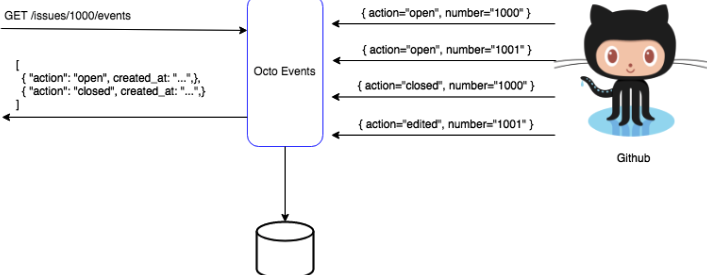

## Ocot Api - Kotlin

#### About Octo

Octo Events is an application that listens to Github Events via webhooks and expose by an api for later use.



###### Contract

```json
{
    "action": "edited", 
    "issue": {
        "url":"https://api.github.com/repos/leco-study-projects/kotlin-octo/issues/9", 
        "repository_url":"https://api.github.com/repos/leco-study-projects/kotlin-octo", 
        "labels_url":"https://api.github.com/repos/leco-study-projects/kotlin-octo/issues/9/labels{/name}", 
        "comments_url":"https://api.github.com/repos/leco-study-projects/kotlin-octo/issues/9/comments", 
        "events_url":"https://api.github.com/repos/leco-study-projects/kotlin-octo/issues/9/events", 
        "html_url":"https://github.com/leco-study-projects/kotlin-octo/issues/9", 
        "id":403982718, 
        "node_id":"MDU6SXNzdWU0MDM5ODI3MTg", 
        "number":9, 
        "title":"Issue test 1", 
        "user":{
            "login":"le-co", 
            "id":4205331, 
            "node_id":"MDQ6VXNlcjQyMDUzMzE", 
            "avatar_url":"https://avatars3.githubusercontent.com/u/4205331?",  
            "url":"https://api.github.com/users/le-co", 
            "type": "User", 
            "site_admin":false
        },  
        "state":"open", 
        "comments":0, 
        "created_at": "", 
        "updated_at":"2019-01-"28T20":"17":55Z", 
        "closed_at":null, 
        "author_association":"CONTRIBUTOR"
    }
}

```

#### About Project

This project exposes the events received from the webhook configured in github. 

#### Hibernate configuration

Change database information in `hibernate.xml`

```xml
<property name="hibernate.connection.driver_class">org.postgresql.Driver</property>
<property name="hibernate.connection.url">jdbc:postgresql://localhost:5432/octo4</property>
<property name="hibernate.connection.username">sa</property>
<property name="hibernate.connection.password">sa</property>
<property name="show_sql">true</property>

```


#### Dependencies

> Java 8

> Kotlin 

> Postgres

> ngrok

#### Tech

> Javalin

> Koin

> Hibernate

> Gradle

#### How do you build project

> With gradle wrapper

```shell
$ ./gradlew build
```

> With gradle local

```shell
$ gradle build
```

#### Postgres with Docker

```shell
$ docker run --name=octo -d -p 5432:5432  -e POSTGRES_PASSWORD=sa -e POSTGRES_USER=sa -e POSTGRES_DB=octo postgres
```

#### Environments Variable

```shell
$ export APPLICATION_PORT=8080 #BY DEFAULT IS 7000
$ export HIBERNATE_CONFIGURATION=8080
```


#### How do you run 

> With gradle wrapper

```shell
$ ./gradlew bootRun
```

> With gradle local

```shell
$ ./gradlew bootRun
```

#### Run Test

 ```shell
 $ ./gradlew test
 ```

> From jar file

```shell
$ java -jar kotlin-octo-0.0.1-SNAPSHOT.jar
```

#### Flyway
 
> The scripts path

```shell
$ resources
$ --------- db
$ ------------ migration
$ ---------------------- V1__Create_Basic_Table.sql
```
